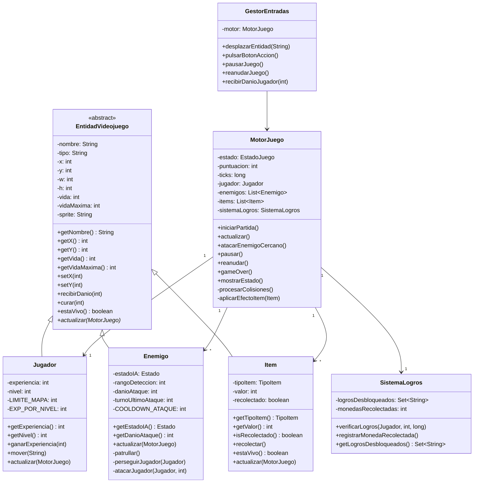
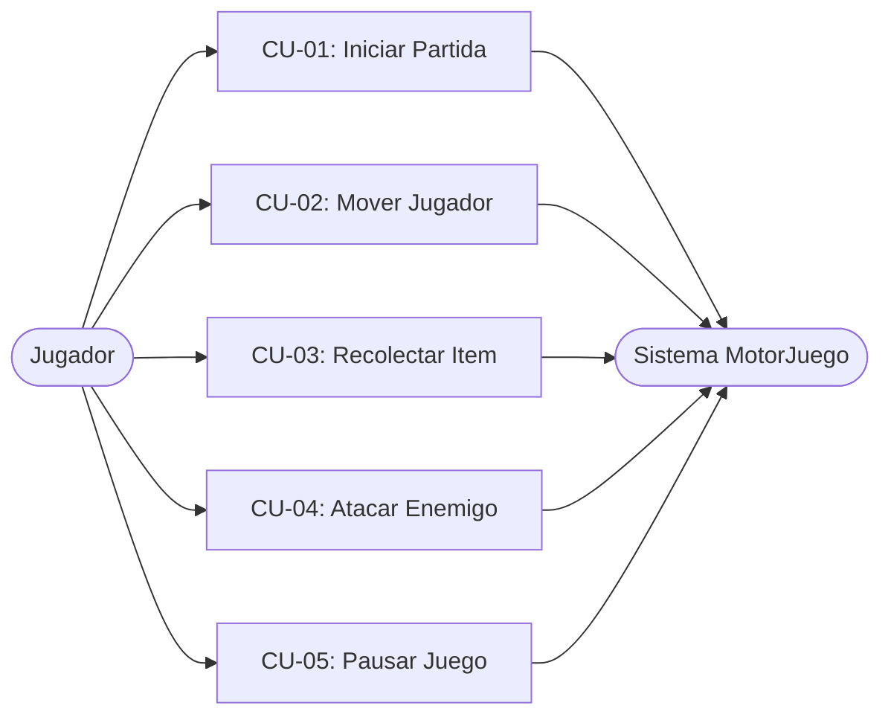

# Dungeon Crawler 2D - Motor de Videojuego

**Versión:** 1.2  
**Autor:** Desarrollado con asistencia de IA (GitHub Copilot + Claude)  
**Fecha:** Junio 2026  
**Licencia:** MIT  

---

## 1. Descripción del Proyecto

**Dungeon Crawler 2D** es un motor de lógica de videojuego tipo RPG/Dungeon Crawler implementado en Java, con **interfaz TUI interactiva** basada en JLine3. Simula un aventurero explorando una mazmorra en cuadrícula 2D (20×20) donde debe derrotar enemigos, recolectar items y desbloquear logros.

### Temática
- **Tipo:** RPG / Dungeon Crawler (Grid-based)
- **Escenario:** Mazmorra mágica 20×20
- **Objetivo:** Derrotar a todos los enemigos para conseguir la victoria
- **Mecánicas:**
  - Movimiento en 4 direcciones con límites de mapa
  - Colisiones jugador-enemigo (daño automático) y jugador-item (recolección)
  - IA de enemigos con máquina de estados: PATRULLAR → PERSEGUIR → ATACAR
  - Ataque cuerpo a cuerpo mediante comando `ACCION`
  - Sistema de experiencia y niveles
  - Sistema de logros con recompensas de XP

---

## 2. Arquitectura del Software

### Principios de Diseño
1. **Modularidad:** 6 clases con responsabilidades claramente delimitadas
2. **Encapsulación:** Todos los atributos son `private`, accesibles mediante getters/setters controlados
3. **Abstracción:** Clase base `EntidadVideojuego` agrupa lo común a todas las entidades
4. **Herencia:** `Jugador`, `Enemigo` e `Item` heredan de `EntidadVideojuego`
5. **Composición:** `MotorJuego` contiene listas de entidades y el `SistemaLogros`

### Clases Implementadas

| Clase | Tipo | Responsabilidad |
|-------|------|----------------|
| `EntidadVideojuego` | Abstracta base | Posición, tamaño, vida, sprite, contrato `actualizar()` |
| `Jugador` | Concreta | Movimiento controlado, experiencia y niveles |
| `Enemigo` | Concreta | IA con máquina de estados (AVANZADA 2) |
| `Item` | Concreta | Items coleccionables (moneda o poción) |
| `MotorJuego` | Orquestador | Estado del juego, bucle principal, colisiones (AVANZADA 1) |
| `GestorEntradas` | Servicio input | Traduce comandos de texto en acciones de juego |
| `SistemaLogros` | Servicio logros | Comprueba y desbloquea logros, premia con XP (AVANZADA 2) |
| `Main` | Conductor | Bucle de consola clásico (sin TUI) |
| `MainTUI` | Conductor TUI | Bucle de juego JLine3 con raw-mode y animaciones |
| `Renderer` | Vista TUI | Mapa ASCII, sidebar, menú y pantallas finales con Display |
| `GameLog` | Utilidad TUI | Buffer circular de mensajes del motor para el sidebar |

> Las clases `Item` y `SistemaLogros` son la clase extra opcional, justificadas porque son imprescindibles para las dos funcionalidades avanzadas elegidas.

---

## 3. Diagrama de Clases UML



---

## 4. Diagrama de Casos de Uso



---

## 5. Especificación de Casos de Uso

### CU-01: Iniciar Partida

| Campo | Descripción |
|-------|-------------|
| **Nombre** | CU-01 Iniciar Partida |
| **Objetivo** | Crear una nueva sesión de juego con todas las entidades inicializadas |
| **Actor Principal** | Jugador |
| **Precondiciones** | `MotorJuego.estado == MENU` |
| **Flujo Principal** | 1. El jugador selecciona "1. Iniciar Nueva Partida" en el menú.<br>2. El sistema crea al jugador en (10,10) con 20 puntos de vida.<br>3. El sistema genera 3 enemigos (Goblin, Orc, Skeleton) con posiciones, vida y rango distintos.<br>4. El sistema genera 3 items en el mapa (2 monedas, 1 poción).<br>5. El sistema cambia el estado a `JUGANDO` e imprime "Partida iniciada". |
| **Flujos Alternativos** | FA-1: Si el estado es `JUGANDO` al invocar `iniciarPartida()`, la llamada reinicia la partida (los enemigos e items se limpian y se recrea todo). |
| **Postcondiciones** | `MotorJuego.estado == JUGANDO`. Jugador, enemigos e items correctamente inicializados en el mapa. |
| **Reglas de Negocio** | El sistema acepta la orden sin restricciones de estado; siempre reinicia desde cero. |

### CU-02: Mover Jugador

| Campo | Descripción |
|-------|-------------|
| **Nombre** | CU-02 Mover Jugador |
| **Objetivo** | Desplazar al jugador una casilla en una de las cuatro direcciones cardinales |
| **Actor Principal** | Jugador |
| **Precondiciones** | `MotorJuego.estado == JUGANDO`. El jugador está vivo. |
| **Flujo Principal** | 1. El jugador introduce el comando (ARRIBA / ABAJO / IZQUIERDA / DERECHA).<br>2. `GestorEntradas.desplazarEntidad(dirección)` valida el estado del motor.<br>3. `Jugador.mover(dirección)` calcula la nueva posición aplicando los límites del mapa (0–20).<br>4. Se actualiza la posición del jugador.<br>5. El sistema imprime la nueva posición. |
| **Flujos Alternativos** | FA-1: Si el estado es `PAUSA` o `GAME_OVER`, el sistema imprime "No se puede mover" y descarta el comando.<br>FA-2: Si la dirección no es válida, se imprime "Dirección inválida" sin modificar la posición. |
| **Postcondiciones** | La posición del jugador cambia en exactamente 1 casilla en la dirección indicada, salvo que alcance el borde del mapa. |
| **Reglas de Negocio** | Solo movimiento ortogonal (sin diagonales). El mapa es de 20×20 (coordenadas 0–20 inclusive). |

### CU-03: Recolectar Item

| Campo | Descripción |
|-------|-------------|
| **Nombre** | CU-03 Recolectar Item |
| **Objetivo** | Aplicar el efecto de un item al pisar su casilla |
| **Actor Principal** | Jugador (acción automática por colisión) |
| **Precondiciones** | Jugador e item comparten la misma posición (x, y). El item no ha sido recolectado aún. |
| **Flujo Principal** | 1. En cada tick, `MotorJuego.procesarColisiones()` compara posición del jugador con cada item activo.<br>2. Al detectar coincidencia, llama a `aplicarEfectoItem(item)`.<br>3. Si tipo = MONEDA: se suman sus puntos a la puntuación y se notifica al `SistemaLogros`.<br>4. Si tipo = POCION: se restauran puntos de vida del jugador.<br>5. El item se marca como recolectado y se elimina del mapa en el siguiente tick. |
| **Flujos Alternativos** | FA-1: Si el jugador ya tiene la vida al máximo y recoge una poción, `curar()` no supera `vidaMaxima`. |
| **Postcondiciones** | El item ya no aparece en el mapa. La puntuación o la vida del jugador se han actualizado. |
| **Reglas de Negocio** | Cada item solo puede ser recolectado una vez (`recolectado == true` bloquea la acción). |

### CU-04: Atacar Enemigo

| Campo | Descripción |
|-------|-------------|
| **Nombre** | CU-04 Atacar Enemigo |
| **Objetivo** | El jugador inflige daño a un enemigo adyacente |
| **Actor Principal** | Jugador |
| **Precondiciones** | `MotorJuego.estado == JUGANDO`. El jugador está vivo. Existe al menos un enemigo vivo a distancia Manhattan ≤ 1. |
| **Flujo Principal** | 1. El jugador introduce el comando `ACCION`.<br>2. `GestorEntradas.pulsarBotonAccion()` delega en `MotorJuego.atacarEnemigoCercano()`.<br>3. El motor busca el enemigo vivo más cercano con distancia Manhattan ≤ 1.<br>4. Aplica `DANIO_ATAQUE_JUGADOR = 3` puntos de daño al enemigo.<br>5. Si el enemigo muere: se suma puntuación y experiencia al jugador. |
| **Flujos Alternativos** | FA-1: Si no hay enemigos a distancia ≤ 1, se imprime "No hay enemigos adyacentes" y no se consume el turno de ataque. |
| **Postcondiciones** | El enemigo objetivo reduce su vida en 3. Si muere, se elimina del mapa y el jugador gana 10 puntos y 10 XP. |
| **Reglas de Negocio** | El rango de ataque del jugador es 1 casilla (distancia Manhattan). Solo ataca a un enemigo por comando. |

### CU-05: Pausar Juego

| Campo | Descripción |
|-------|-------------|
| **Nombre** | CU-05 Pausar / Reanudar Juego |
| **Objetivo** | Detener temporalmente o reanudar la ejecución del motor |
| **Actor Principal** | Jugador |
| **Precondiciones** | Para pausar: `estado == JUGANDO`. Para reanudar: `estado == PAUSA`. |
| **Flujo Principal** | 1. El jugador introduce el comando `PAUSA`.<br>2. Si el estado es `JUGANDO`, el motor cambia a `PAUSA` y detiene `actualizar()`.<br>3. El sistema imprime "Juego pausado".<br>4. Al volver a introducir `PAUSA`, el motor cambia a `JUGANDO` y reanuda el bucle. |
| **Flujos Alternativos** | FA-1: Si el comando `PAUSA` se introduce en estado `GAME_OVER` o `VICTORIA`, se ignora. |
| **Postcondiciones** | El estado alterna entre `JUGANDO` y `PAUSA` en cada invocación. |
| **Reglas de Negocio** | No hay tiempo límite de pausa. Las entidades no se actualizan mientras el estado sea `PAUSA`. |

---

## 6. Funcionalidades Avanzadas Implementadas

### AVANZADA 1: Detector de Colisiones Simple
**Ubicación:** `MotorJuego.procesarColisiones()` y `MotorJuego.aplicarEfectoItem()`

Detecta en cada tick:
- **Jugador ↔ Enemigo:** Comparación de coordenadas exactas `(x == x && y == y)`. Si coinciden, el enemigo inflige su daño. Si el jugador muere, se activa Game Over.
- **Jugador ↔ Item:** Misma comparación. Si coinciden, se aplica el efecto (puntos o curación) y el item desaparece.

### AVANZADA 2: Comportamiento NPC del Enemigo + Sistema de Logros
**Ubicación:** `Enemigo.actualizar()` y `SistemaLogros`

**Enemigo - Máquina de estados (distancia Manhattan):**

| Condición | Estado | Comportamiento |
|-----------|--------|----------------|
| dist ≤ 1 | ATACAR | Inflige `danioAtaque` con cooldown de 2 turnos |
| dist ≤ rangoDeteccion | PERSEGUIR | Se mueve 1 casilla hacia el jugador por turno |
| dist > rangoDeteccion | PATRULLAR | Movimiento aleatorio en ±1 por eje |

**Logros desbloqueables:**

| ID | Condición | Recompensa |
|----|-----------|-----------|
| ELIMINAR_TODOS_ENEMIGOS | Sin enemigos vivos | +100 XP |
| RECOLECTAR_5_MONEDAS | 5 monedas recogidas | +50 XP |
| NIVEL_10 | Jugador en nivel 10 | +200 XP |
| SUPERVIVIR_10_TURNOS | 10 ticks completados | +75 XP |

---

## 7. Compilación y Ejecución

### TUI interactiva (recomendado) — requiere Java 11+ y Maven

```bash
# Bash / Git Bash
./compile.sh          # construye el JAR y lanza la TUI

# PowerShell (Windows)
.\compile.ps1         # igual
```

### Versión clásica por consola

```bash
./compile.sh classic  # compila con javac y lanza Main
.\compile.ps1 classic # PowerShell
```

### Suite de tests

```bash
./compile.sh test
.\compile.ps1 test
```

**Requisitos TUI:** Java 11+, Maven 3.9+ (incluido en el repo).  
**Requisitos clásico:** Java 8+, sin dependencias.

### Controles TUI

| Tecla | Acción |
|-------|--------|
| W / ↑ | Mover arriba |
| S / ↓ | Mover abajo |
| A / ← | Mover izquierda |
| D / → | Mover derecha |
| ESPACIO / F | Atacar |
| P | Pausar / Reanudar |
| Q | Menú principal |

---

## 8. Bitácora del Uso de Inteligencia Artificial

### Herramienta Utilizada
**GitHub Copilot** (VS Code) como asistente principal de codificación, con revisiones y correcciones mediante **Claude** (Anthropic).

### Muestra de Prompts Exactos

#### Prompt 1: Arquitectura base
```
Crea una clase abstracta EntidadVideojuego en Java que represente
cualquier entidad del juego. Debe tener atributos privados para:
- nombre, tipo, posición (x, y), tamaño (w, h)
- vida y vidaMaxima
- un sprite para la UI futura

Incluye getters/setters controlados y métodos públicos:
- recibirDanio(int): reduce vida con mínimo 0
- curar(int): restaura vida con máximo vidaMaxima
- estaVivo(): boolean

Haz que tenga un método abstracto actualizar(MotorJuego motor)
para que las subclases implementen su lógica de IA o comportamiento.
```

#### Prompt 2: IA del enemigo
```
Crea una clase Enemigo que extienda EntidadVideojuego.
Implementa una máquina de estados con 3 estados:
- PATRULLAR: movimiento aleatorio en ±1 por eje
- PERSEGUIR: acercarse al jugador si está en rango de detección
- ATACAR: infligir daño si es adyacente (distancia Manhattan ≤ 1)

Usa distancia Manhattan para determinar las transiciones.
El cooldown entre ataques debe medirse en turnos (ticks del motor),
no en milisegundos de tiempo real, para que sea consistente
con el modelo por turnos del juego.
```

### Errores de la IA y Correcciones Aplicadas

#### Error 1: Cooldown de ataque con tiempo real
**Problema detectado:** Copilot generó el cooldown del enemigo usando `System.currentTimeMillis()`. En un juego controlado por teclado el jugador puede tomarse 10 segundos entre pulsar teclas, lo que hacía que el cooldown de 2 segundos fuera irrelevante y el enemigo atacase en cada tick al reanudar.  
**Corrección:** Se reemplazó por `turnoUltimoAtaque: int` que almacena el tick del último ataque. El cooldown se evalúa como `tickActual - turnoUltimoAtaque >= COOLDOWN_ATAQUE` (constante = 2 turnos).

#### Error 2: Método `estaVivo()` duplicado en Jugador
**Problema detectado:** Copilot generó un `@Override` de `estaVivo()` en `Jugador` que simplemente llamaba a `this.getVida() > 0`, idéntico a la implementación del padre `EntidadVideojuego`.  
**Corrección:** Se eliminó el override redundante. `EntidadVideojuego.estaVivo()` ya implementa correctamente `vida > 0`, por lo que la subclase no necesita sobreescribirlo.

#### Error 3: Clases Item y SistemaLogros eliminadas sin actualizar el README
**Problema detectado:** Una sesión previa con Copilot borró `Item.java` y `SistemaLogros.java` del código (aparecen como archivos `D` en `git status`) pero el README los mencionaba como implementados. El diagrama UML también hacía referencia a ellos.  
**Corrección:** Se reimplementaron ambas clases desde cero y se integró `Item` en `MotorJuego.procesarColisiones()` y `SistemaLogros` en `MotorJuego.actualizar()`.

### Reflexión Crítica

#### Ventajas
- **Velocidad de scaffolding:** La arquitectura base (herencia, getters/setters, toString) se generó en minutos en lugar de horas.
- **Sugerencias de diseño:** Copilot propuso correctamente la máquina de estados para la IA del enemigo y el patrón de composición en MotorJuego.
- **Documentación automática:** Los JavaDoc de primer borrador fueron útiles como punto de partida.

#### Peligros
- **Errores semánticos silenciosos:** El cooldown con `System.currentTimeMillis()` compilaba y ejecutaba sin error, pero su comportamiento era incorrecto en el contexto del juego. Sin conocer el dominio, es imposible detectar este tipo de bug automáticamente.
- **Over-engineering y luego under-engineering:** Copilot primero propuso 10 clases; al pedirle que redujera al máximo de 6, eliminó clases que eran necesarias (`Item`, `SistemaLogros`) sin advertirlo.
- **Ilusión de comprensión:** Es tentador aceptar código que parece correcto sin ejecutarlo mentalmente. Todos los errores encontrados superaron esta barrera inicial.

#### Balance bajo presión de tiempo
- **Pro:** El tiempo de desarrollo se redujo aproximadamente a la mitad para el código repetitivo (constructores, getters, toString, estructuras de datos básicas).  
- **Contra:** Cada error de la IA costó más tiempo en debugging del que hubiera costado escribir el código manualmente, porque primero había que entender el código generado antes de poder depurarlo.  
- **Conclusión:** La IA es más eficiente como asistente de scaffolding que como desarrolladora autónoma. La lógica de dominio y las decisiones arquitectónicas deben venir siempre del desarrollador.

---

## 9. Estructura de Directorios

```
entornos-p3/
├── README.md
├── LICENSE
├── pom.xml                          ← build Maven (JLine3 3.27.1)
├── compile.sh                       ← launcher Bash
├── compile.ps1                      ← launcher PowerShell
├── target/
│   └── dungeon-crawler-2d-1.2.0.jar ← fat JAR ejecutable
└── src/
    ├── main/java/com/dungeoncrawler/
    │   ├── Main.java                ← entrada clásica
    │   ├── MainTUI.java             ← entrada TUI (JLine3)
    │   ├── core/
    │   │   ├── EntidadVideojuego.java
    │   │   ├── Jugador.java
    │   │   ├── Enemigo.java
    │   │   ├── Item.java
    │   │   ├── MotorJuego.java
    │   │   ├── GestorEntradas.java
    │   │   └── SistemaLogros.java
    │   └── tui/
    │       ├── Renderer.java
    │       ├── GameLog.java
    │       └── LogInterceptor.java
    └── test/java/com/dungeoncrawler/
        └── TestRunner.java
```

---

## 10. Referencias

- Conventional Commits: https://www.conventionalcommits.org/
- Java Style Guide: Oracle Docs
- UML Diagrams: Mermaid.js
- Clean Code: Robert C. Martin

---

**Estado:** Completado  
**Última actualización:** 1 de junio de 2026  
**Versión actual:** 1.2
